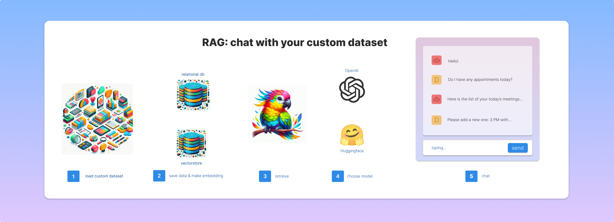

<!DOCTYPE html>
<html>
<head>
    <style>
        .banner-container {
            max-width: 100%;
            text-align: center;
            overflow: hidden;
        }

        .banner-image {
            width: 100%;
            height: auto;
        }
    </style>
</head>

<body>

    <div class="banner-container">
        
    </div>

# License 🔓
Please read this project license: https://github.com/pyautoml/machine_learning/blob/main/RAG_with_agents/License.md

# Project 📂
This project shows ste-by-step how to build and use RAG using the following technologies:
- Qdrant vectorstore (open-souece vector database),
- MS SQL (local, community version),
- Transfrormers from Huggingface,
- open-source models like Mistral, Vicuna, Falcon, and many more,
- commercial, paid models like GPT-4 from OpenAI.
- agetns, semi-independent tools that are able to decide which function should be run next.

### To run this code you need to install a few external libraries by entering into the CMD / Terminal:
```bash
pip install -r ./requirements.txt
```

Libraries stated in the 'requirements.txt':
```
black
openai
pyodbc
sqlite3
sqlalchemy
transformers
qdrant-client
python==3.11.0
```

# Step by step 🪄
This project aims to:
- download and prepare data,
- load data to a relational database (MS SQL),
- prepare embeddings based on the data stored in the relational database and store them in Qdrant,
- create a small toolset to wrangle and manage data, including: selects, inserts, updates, and deleteion from both vector and relational databases,
- connecting agents and specify their goals,
- create and maintain metrics and other data on the performance of tested models,
- prepare a simple GUI i Streamlit to mimic a chat window allowing users to use RAG in real-time,
- add seaborn / matplotlib visualisations.


</body>

</html>
